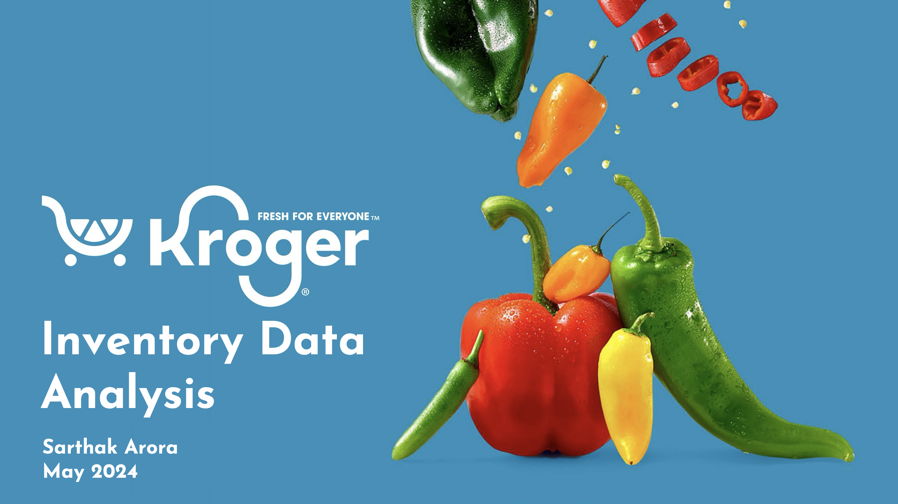

# 🛒 Retail Inventory Analytics with Python

## 🎥 Project Overview

In this video walkthrough, I demonstrate how **data analytics** can be leveraged to solve one of retail’s most pressing challenges — **overstocking and understocking**. By analyzing **inventory data from Kroger**, I identify which products are consistently overstocked or understocked, providing actionable insights for better inventory control.

This analysis plays a key role in making **informed business decisions** that support operational efficiency and long-term growth. While no direct action is requested from viewers, the video is packed with valuable context for anyone interested in **inventory management and retail analytics**.

🔗 **Watch the video here**:  
[Loom: Retail Inventory Analytics Demo](https://www.loom.com/share/ed85748e5cfb48f0b5439b8200607be0)

